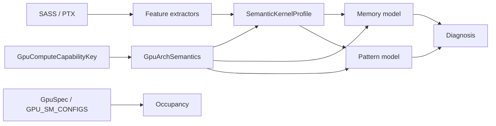

# PaxZas Refinement Plan — Architecture-Anchored Semantics

A consolidated, refinement-only plan for connecting the existing
**feature extraction + models** (`memory_model.ts`, `pattern_model.ts`,
`occupancy`, `diagnose.ts`) to the existing **architecture table**
(`gpu_spec.ts` / `GPU_SM_CONFIGS`).

> **What we are *not* doing:** ML, AMD, full IR, new schemas for raw
> features. This is parameterization, not redesign.

---

## 0. Goal and non-goals

**Goal.** Move PaxZas from
`SASS/PTX → features → heuristics with hardcoded constants`
to
`SASS/PTX → arch-aware decoding → normalized semantic features → models`,
without changing feature-extraction shape or the report contract.

**Non-goals.**

- Replacing `GpuSpec` / `GPU_SM_CONFIGS`.
- Touching `SassInstructionFeatures` / `PtxInstructionFeatures` field sets.
- Changing the kernel suite or diagnosis rule set.
- Building a per-instruction microarchitectural model.

**Acceptance (when this is "done").**

1. No FLOP/throughput-style literal constant lives in `memory_model.ts`
   or `pattern_model.ts`. All come from `GpuArchSemantics`.
2. `analyze.ts` resolves a single `(GpuSpec, GpuArchSemantics)` pair from
   the chosen compute capability and threads it everywhere consistently.
3. The `KERNEL_CATALOG` validation suite passes against SASS dumps from
   at least two distinct compute capabilities (e.g. sm_80 + sm_90)
   without architecture-specific test branches.
4. Default CC (sm_80 / cc 8.0) yields **identical** report values vs the
   pre-change baseline (parity gate).
5. `analysis_mode` carries a structured `analysis_context` with a
   confidence score and reasons.

---

## 1. Target data flow



`GpuSpec` keeps owning **resource limits** (occupancy). `GpuArchSemantics`
owns **interpretation** (FLOP weights, thresholds, opcode families).

---

## 2. Phase 0 — Constants manifest (half day, blocking)

Single deliverable: a table mapping every hidden architectural constant
to a future `GpuArchSemantics` field. Shipped as a doc section, not
code. Suggested rows (current behavior preserved at default CC):

| Current constant | File · symbol | Proposed semantic field |
|---|---|---|
| `wmma_ops * 512` | `memory_model.ts` · `sassFlopsProxyFromFeatures` | `compute.tensor_fp_flops_per_op` |
| `(tensor_ops - wmma_ops) * 64` | same | `compute.tensor_int_flops_per_op` |
| `sfu_ops * 4` | same | `compute.sfu_flops_per_op` |
| `fp64_arith_ops * 14` | same | `compute.fp64_relative_cost` |
| `arithmetic_ops * 2` | same | `compute.scalar_fp_flops_per_op` |
| `computeToMemory > 8.0` | `pattern_model.ts` · GEMM/tiled branch | `thresholds.compute_to_memory_high` |
| `computeToMemory < 2.0` (streaming, balanced) | `pattern_model.ts` | `thresholds.memory_bound_low` |
| `computeToMemory < 4.0` (control_heavy gating, reduction archetype) | `pattern_model.ts` | `thresholds.compute_balanced_high` |
| `computeToMemory > 4.0` (`tensorDominated`) | `pattern_model.ts` | `thresholds.tensor_dominated_min` |
| `computeToMemory < 1.0` (RMW / histogram archetype) | `pattern_model.ts` | `thresholds.compute_to_memory_low` |
| `branchDensity > 0.1`, `branchPerMem > 0.08` | `pattern_model.ts` | `thresholds.branch_density_high`, `branch_per_mem_high` |
| `barrierDensity > 0.02` (`syncHeavy`) | `pattern_model.ts` | `thresholds.barrier_density_high` |
| `loopDensity > 0.05` (`highLooping`) | `pattern_model.ts` | `thresholds.loop_density_high` |
| Tensor / async / TMA opcode prefixes (`HMMA`, `WGMMA`, `CP.ASYNC`, `UTMALDG`, `LDGSTS`) | `sass_features.ts` · `classifyOpcode` | `instruction_map.{tensor_ops, async_ops, tma_ops}` |

Output is a one-page `docs/ARCH_SEMANTICS_MANIFEST.md` (or section in
this file). No code changes yet.

> **Definition of done:** every literal in this table is annotated with
> file/line and a proposed field name. Reviewer can hand the table to
> Phase 1 and stop reading source.

---

## 3. Phase 1 — `GpuArchSemantics` module (1–2 days)

New file: `src/analyzer/gpu_arch_semantics.ts`. No imports from
`memory_model.ts` / `pattern_model.ts` to keep the dependency arrow
one-way.

```ts
// Concrete shape (final names tbd; matches Phase 0 manifest 1:1).
export interface GpuArchSemantics {
  cc: GpuComputeCapabilityKey;

  compute: {
    scalar_fp_flops_per_op: number;     // currently 2
    tensor_fp_flops_per_op: number;     // currently 512 (HMMA proxy)
    tensor_int_flops_per_op: number;    // currently 64
    sfu_flops_per_op: number;           // currently 4
    fp64_relative_cost: number;         // currently 14 (proxy weight)
  };

  memory: {
    supports_async_copy: boolean;       // CP.ASYNC / LDGSTS lowering
    supports_tma: boolean;              // UTMALDG / UTMASTG
  };

  instruction_map: {
    tensor_ops: readonly string[];      // prefixes, e.g. ["HMMA", "WGMMA", ...]
    async_ops: readonly string[];       // ["CP.ASYNC", "LDGSTS"]
    tma_ops:   readonly string[];       // ["UTMALDG", "UTMASTG"]
    sfu_ops:   readonly string[];       // ["MUFU"]
  };

  thresholds: {
    compute_to_memory_high: number;     // 8.0
    compute_to_memory_low: number;      // 1.0
    compute_balanced_high: number;      // 4.0
    memory_bound_low: number;           // 2.0
    tensor_dominated_min: number;       // 4.0
    branch_density_high: number;        // 0.10
    branch_per_mem_high: number;        // 0.08
    barrier_density_high: number;       // 0.02
    loop_density_high: number;          // 0.05
  };
}

export function getArchSemantics(
  cc: GpuComputeCapabilityKey,
): GpuArchSemantics;

// Tiny helper used by sass_features (Phase 3 only):
export function matchesOpcodeMap(
  opcode: string,
  prefixes: readonly string[],
): boolean;
```

**Implementation rule:** **all CC keys return the same numeric values**
in this phase (parity with today). Differences land in Phase 2b only
when justified by docs or measurement.

**Tests** (`tests/analyzer/gpu_arch_semantics.test.ts`):

- For every key in `GpuComputeCapabilityKey`, `getArchSemantics(cc)`
  returns a fully populated object.
- Threshold ordering invariants:
  `memory_bound_low < compute_balanced_high < compute_to_memory_high`,
  `compute_to_memory_low < memory_bound_low`.
- `supports_async_copy` is `true` for cc ≥ 8.0, `supports_tma` for
  cc ≥ 9.0.

---

## 4. Phase 2 — Centralize FLOP weights and thresholds (1 day, parity-locked)

### 2a. Memory / FLOP path

In `memory_model.ts`:

- Add `semantics: GpuArchSemantics` to `analyzeMemory(...)` and to
  `sassFlopsProxyFromFeatures(...)` (or, preferred, replace the second
  with a non-exported helper consumed by `heuristicBottleneck`).
- Replace literals listed in the manifest with semantic fields.

### 2b. Pattern path

In `pattern_model.ts`:

- Add `semantics: GpuArchSemantics` to `analyzePattern(...)`.
- Replace every threshold literal by the corresponding
  `semantics.thresholds.*` lookup.

### Plumbing

- `runModelsParallelOrSync` (`src/analyzer/run_models_parallel.ts`):
  add `semantics` to its input type, forward into `analyzeMemory` /
  `analyzePattern`.
- Workers (`workers/memWorker.ts`, `workers/patWorker.ts`): pass
  `semantics` through the message payload.
- `analyze.ts`: resolve `semantics = getArchSemantics(cc)` once,
  alongside `spec`, and inject.

### Parity gate

Run the existing snapshot/golden tests before/after with **default CC =
8.0** numbers seeded from manifest. Diff must be empty. This locks in
"refactor only" before anyone tunes per-CC numbers.

> **2b is shipped only after Phase 7 produces evidence.** Until then,
> per-CC factor differences are kept at zero.

---

## 5. Phase 3 — Architecture-aware SASS decoding (1–2 days, optional)

Default behavior of `classifyOpcode` is already prefix-driven. Goal here
is to make the **prefix sets configurable** so cc-specific lowerings
(e.g. `WGMMA` only on cc ≥ 9.0) can be expressed declaratively.

Concrete steps:

1. Pass an `OpcodeSemantics` object (slice of `instruction_map`) into
   `extractSassFeatures` / `classifyOpcode`. Default = union of all
   generations (current behavior) so omitting the arg keeps existing
   call sites compiling.
2. When `analyze.ts` knows the target CC, pass the CC-specific
   `instruction_map`.
3. If an opcode matches an unsupported family for the chosen CC
   (e.g. `WGMMA` on 7.0): still increment `tensor_ops` (so diagnostics
   work) but emit a `feature_flags.unsupported_for_cc` flag consumed by
   Phase 6 confidence scoring.

**Non-goal:** rewriting `SASS_OPCODE_RE` parsing or width-bucket logic.
Those are correct.

---

## 6. Phase 4 — Thin semantic normalization layer (1 day)

New module: `src/analyzer/semantic_profile.ts`.

```ts
export interface SemanticKernelProfile {
  compute_intensity: number;            // FLOPs / bytes (using sem-weighted FLOPs)
  compute_intensity_normalized: number; // / tensor_fp_flops_per_op (cross-CC compare)
  sync_density: number;                 // barriers / (compute_ops + 1)
  tensor_usage: number;                 // tensor_ops / (compute_ops + 1)
  reuse_strength: number;               // shared_loads / (global_mem_ops + 1)
}

export function buildSemanticKernelProfile(
  ptx: PtxInstructionFeatures | undefined,
  sass: SassInstructionFeatures | undefined,
  semantics: GpuArchSemantics,
): SemanticKernelProfile;
```

Rules:

- Pure function, no I/O, no `analyze.ts` coupling.
- Adds **two** views: `compute_intensity` (raw, current contract) and
  `compute_intensity_normalized` (new, cross-CC). Models keep using the
  raw view for now; UI/report can opt into the normalized view later.
- Single ownership of "normalize by arch" math. No model duplicates it.

---

## 7. Phase 5 — Models consume semantics (surgical)

| Model | Input change | Behavior change |
|---|---|---|
| Memory | `+ semantics` | FLOP weights from `semantics.compute`; intensity classification thresholds (if any) from `semantics.thresholds`. |
| Pattern | `+ semantics` | Every `computeToMemory`, `branch*`, `barrier*`, `loop*` cutoff from `semantics.thresholds`. |
| Occupancy | unchanged | Already keyed off `GpuSpec`. Just confirm `analyze.ts` resolves the same CC for both. |
| Diagnosis | unchanged | Reads `MemoryAnalysis` + `PatternResult`; no rule duplication. |

**Forbidden:** any model importing `gpu_arch_semantics.ts` to look
something up by CC. Semantics is always passed in. This keeps models
unit-testable without `gpu_spec.ts` initialization.

---

## 8. Phase 6 — Strengthen `analysis_mode` (additive schema)

Today: string `analysis_mode` ∈ `native | cross-arch-what-if |
preset-only-what-if` plus a free-form `analysis_mode_note`.

Add (do not replace):

```ts
export interface AnalysisContext {
  mode: AnalyzerReport["analysis_mode"];
  arch_source: "sass" | "ptx" | "preset";
  target_cc: GpuComputeCapabilityKey;
  sass_cc_tags?: string[];
  confidence: number;            // 0..1
  confidence_reasons?: string[]; // human-readable bullets
}

// In AnalyzerReport:
analysis_context?: AnalysisContext;
```

Confidence rules (initial, refine in Phase 7):

| Condition | Δ confidence |
|---|---|
| Base | 1.0 |
| `analysis_mode === "cross-arch-what-if"` | −0.3 |
| `analysis_mode === "preset-only-what-if"` | −0.5 |
| Any opcode flagged `unsupported_for_cc` (Phase 3) | −0.1 each, capped −0.3 |
| PTX-only (no SASS match) | −0.2 |

Backwards compat: `analysis_mode` and `analysis_mode_note` keep their
current shape; `extension.ts`'s status-bar formatting is untouched.

---

## 9. Phase 7 — Cross-CC validation (this is the proof)

Builds on the work just landed in `tests/validation_suite.test.ts` and
`tests/helpers/validation_dump_loader.ts`.

### 7.1 Artifact layout

```
PaxZas/tests/data/
  sass/
    sm70/  *.sass
    sm80/  *.sass
    sm90/  *.sass
  ptx/
    sm70/  *.ptx
    sm80/  *.ptx
    sm90/  *.ptx
```

Loader extension: env vars
`PAXZAS_VALIDATION_SASS_DIR=tests/data/sass/sm80` already work; add a
small wrapper `forEachCc(["7.0","8.0","9.0"], cb)` in the loader to
iterate matching subdirs without changing existing tests.

### 7.2 Build matrix (PaxZasValidation)

Target sm_70 (Volta), sm_80 (Ampere), sm_90 (Hopper). Optional later:
sm_75, sm_89, sm_100, sm_120.

For each kernel in `KERNEL_CATALOG.md`, produce
`cuobjdump --dump-sass` and `--dump-ptx` per arch and drop into the
matching `tests/data/<kind>/sm<NN>/` folder.

### 7.3 Cross-CC stability tests

A new file `tests/cross_cc_stability.test.ts`:

For each kernel listed in the catalog:

1. Run analysis with `cc = 7.0`, `8.0`, `9.0` using the same source
   kernel's SASS dump for each arch.
2. Assert **stability of categorical outputs**: `pattern.class`,
   `archetype` (where defined), `memory.class`.
3. Allow numeric drift in counts; assert ranges, not equalities.
4. When `pattern.class` flips across CC, the test fails with a clear
   diff so the next step is "fix semantics" or "intentionally relax."

This is what proves Phase 2/5 are not architecture-biased.

### 7.4 Compiler-difference allowlist

Tracked in `tests/cross_cc_allowlist.json` so legitimate compiler
behavior changes (e.g. `LDG.E.STRONG.GPU` lowering on Hopper) do not
churn the suite.

---

## 10. Phase 8 — Documentation and guardrails

- `FEATURE_REFERENCE.md`: new section "Raw features vs arch semantics
  vs normalized profile" linking to `gpu_arch_semantics.ts`.
- `gpu_spec.ts` header: pointer comment "limits live here, *interpretation*
  in `gpu_arch_semantics.ts`."
- `KERNEL_CATALOG.md`: appendix table noting which fields are arch-stable
  by design vs arch-sensitive.
- No scripts, no ML stack, no full IR.

---

## 11. Sequencing

| Slice | Phases | Dependencies | Parity gate |
|---|---|---|---|
| 1 | 0 + 1 + factory tests | — | yes (no behavior change) |
| 2 | 2a memory + pattern wiring | slice 1 | **strict** (snapshot equality) |
| 3 | 3 opcode maps | slice 2 | yes |
| 4 | 4 + 5 (profile + plumbing) | slice 3 | yes |
| 5 | 6 (`analysis_context`) + 7.1–7.3 | slice 2 | new tests, no diff on existing |
| 6 | 2b per-CC tuning + 7.4 allowlist | slice 5 | drift allowed only with evidence |
| 7 | 8 (docs) | anytime | n/a |

---

## 12. Risks and mitigations

| Risk | Likelihood | Mitigation |
|---|---|---|
| Snapshot drift at default CC during Phase 2a | Medium | Parity-locked numbers seeded from manifest. CI fails on diff. |
| Threshold names drift between manifest and code | Low | Phase 0 manifest is the single source of truth; Phase 1 mirrors it 1:1. |
| Per-CC tuning regresses real workloads | Medium | Tuning gated on Phase 7 evidence; allowlist captures intentional flips. |
| Worker payload bloat (semantics passed every call) | Low | `GpuArchSemantics` is a small frozen object; deep-clone-safe. |
| Models accidentally import `gpu_arch_semantics.ts` | Low | Lint rule or import-guard test; semantics flows in only via args. |

---

## 13. Code anchor quick reference

| What | Path | Notable lines |
|---|---|---|
| `GpuSpec`, `GPU_SM_CONFIGS` | `src/analyzer/gpu_spec.ts` | full file |
| FLOP proxy weights | `src/analyzer/memory_model.ts` | `sassFlopsProxyFromFeatures` ~100–117 |
| Pattern thresholds (computeToMemory, branch, barrier, loop) | `src/analyzer/pattern_model.ts` | ~270–310, ~660–710, ~730–760 |
| Pattern / archetype branches | `src/analyzer/pattern_model.ts` | ~659–760 |
| Analysis mode resolution | `src/analyzer/analyze.ts` | ~145–172 |
| Models orchestrator | `src/analyzer/run_models_parallel.ts` | `runModelsParallelOrSync` |
| Workers | `src/analyzer/workers/{memWorker,patWorker}.ts` | full files |
| Opcode classification | `src/analyzer/sass_features.ts` | `classifyOpcode`, `SASS_OPCODE_RE` |
| Validation loader | `tests/helpers/validation_dump_loader.ts` | full file |
| Catalog tests | `tests/validation_suite.test.ts` | full file |

---

## 14. One-line summary

Introduce `GpuArchSemantics` beside the unchanged `GpuSpec`, route a
single per-CC `semantics` value through `analyze.ts` into
`analyzeMemory` / `analyzePattern`, replace every FLOP weight and
threshold literal with a field on it, prove cross-CC stability with a
per-arch dump matrix, and surface the result in an additive
`analysis_context` block.
